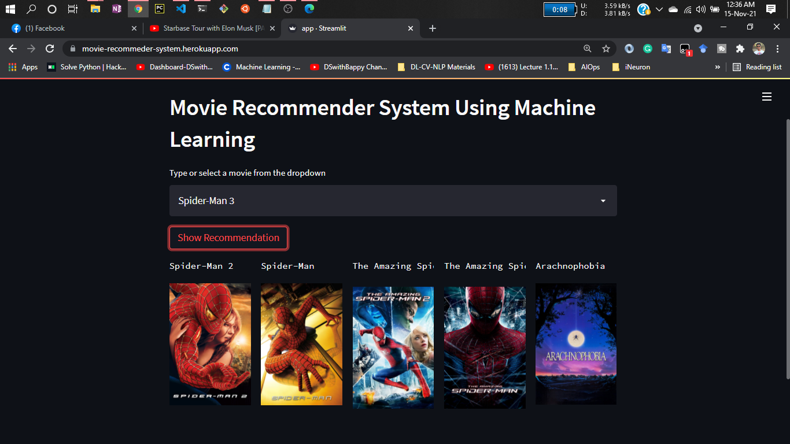

# Project: Movie Recommender System Using Machine Learning!


- Recommendation systems have become really important in our busy lives. We're all pressed for time, juggling various tasks within the limited 24 hours we have. That's where recommendation systems come in handy. They help us make better choices without draining our mental energy.

- So, what do these recommendation systems do? Well, their main job is to find stuff that you'd find interesting. They use smart computer algorithms (that's the Artificial Intelligence part) to sift through tons of options and create a special list of things you might like. This list is based on your personal profile, what you've searched for or looked at before, and what other people similar to you are into. It's like having your own personalized guide to cool and useful stuff.

- How do they figure this out? The systems use clever tricks and patterns from the data they have about you. They predict what you might enjoy based on your history and what folks like you tend to enjoy. It's like having a friend who knows your taste really well and suggests things you'd probably love. That's recommendation systems at work!

# Types of Recommendation System :

# Types of Recommendation Systems:
### 1) Content-Based:
- Content-based systems look at the details of items and consider their characteristics.

Examples include Twitter and YouTube.

- It's like recommending music based on what you've listened to or suggesting similar videos based on what you've watched before. The system creates a sort of profile for you.

- These systems make suggestions by looking at your past interests and the features of items. If you liked something similar before, it thinks you'll like it again.

- One issue is that it might suggest really obvious things because it gets too stuck on what you've liked before.

### 2) Collaborative-Based:
- Collaborative filtering systems focus on how users interact with items.

- Think of it like grouping users who like the same things or have similar preferences.

- For example, if you like a certain book, and someone else likes the same book and another one, the system thinks you might also like that second book.

- But there are problems like needing a big matrix of user-item interactions, which can be computationally heavy and might only suggest popular stuff.

### 3) Hybrid-Based:
- Hybrid systems mix both content and collaborative info to avoid issues from relying on just one type.

- They use a combination of methods, like using word patterns to understand content and group users.

# About this Project:
This is a web app made with Streamlit that recommends movies based on user interests.


# Demo:




# Dataset has been used:

* [Dataset link](https://www.kaggle.com/tmdb/tmdb-movie-metadata?select=tmdb_5000_movies.csv)

# Concept used to build the model.pkl file : cosine_similarity

1 . Cosine Similarity is a metric that allows you to measure the similarity of the documents.

2 . In order to demonstrate cosine similarity function we need vectors. Here vectors are numpy array.

3 . Finally, Once we have vectors, We can call cosine_similarity() by passing both vectors. It will calculate the cosine similarity between these two.

4 . It will be a value between [0,1]. If it is 0 then both vectors are complete different. But in the place of that if it is 1, It will be completely similar.

# How to run?
### STEPS:

Clone the repository

```bash
https://github.com/NagendraSethi/Movie-Recommender-System.git
```
### STEP 01- Create a conda environment after opening the repository

```bash
conda create -p movie python==3.8 -y
```

```bash
conda activate movie/
```


### STEP 02- install the requirements
```bash
pip install -r requirements.txt
```


```bash
#run this file to generate the models

Movie Recommender_System_System.ipynb
```

Now run,
```bash
streamlit run app.py
```